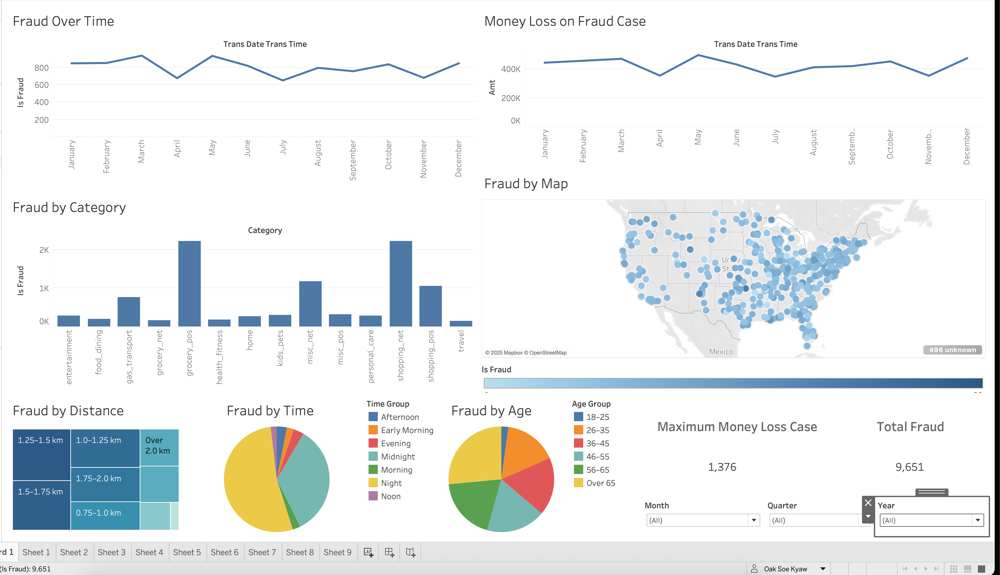

# Credit-Card-Fraud-Detection-DSS

A web-based application that uses a machine learning model to detect fraudulent credit card transactions. This project serves as a Decision Support System (DSS) for financial operators and managers.


---

## 📋 Table of Contents
- [Features](#-features)
- [Dataset](#-dataset)
- [Model Input Features](#-model-input-features)
- [Dashboard Visualizations Summary](#-dashboard-visualizations-summary)
- [Technology Stack](#-technology-stack)
- [Installation](#-installation)
- [Usage](#-usage)
- [Project Structure](#-project-structure)
- [License](#-license)

---

## ✨ Features

* **User Authentication:** Secure login system for different user roles.
* **Role-Based Access Control:** * **Operator View:** Allows users to input transaction data and receive a real-time fraud prediction.
    * **Manager View:** Provides a dashboard to oversee and review flagged transactions (conceptual).
* **Real-Time Fraud Detection:** Leverages a pre-trained machine learning model (`model.pkl`) to classify transactions as either fraudulent or legitimate.
* **Interactive Web Interface:** A user-friendly interface built with Flask and HTML for easy interaction.

---

## 📊 Dataset

This project utilizes a synthetic dataset of credit card transactions, meticulously designed to model both legitimate and fraudulent activities. The data covers a two-year period, from January 1, 2019, to December 31, 2020, and encompasses transactions from 1,000 customers across a pool of 800 merchants.

The dataset was generated using the Sparkov Data Generation tool, a powerful open-source simulator developed by Brandon Harris. Instead of using real-world events, the simulator creates realistic transaction data by defining various customer profiles. Each profile is characterized by distinct statistical behaviors, such as transaction frequency, spending habits, and monetary distributions for different purchasing categories.

To achieve a more comprehensive and diverse representation of real-world scenarios, the author of the Kaggle dataset generated data across all available customer profiles and merged the results into the single, unified dataset used in this project.

A special acknowledgement goes to Brandon Harris for creating the simulation tool that made this high-quality synthetic dataset possible.

---

## Model Input Features

The model uses the following features (independent variables) to predict the outcome. These are the inputs required in the web interface:

| Feature          | Description                                                                 | Data Type   |
| ---------------- | --------------------------------------------------------------------------- | ----------- |
| `Amount`         | The monetary value of the transaction.                                      | Numerical   |
| `Distance (km)`  | The distance from the cardholder's home to the transaction location in km.  | Numerical   |
| `Age`            | The age of the cardholder at the time of the transaction.                   | Numerical   |
| `Transaction Time`| The specific date and time when the transaction occurred.                   | Datetime    |
| `Merchant`       | The identifier for the merchant or vendor.                                  | Categorical |
| `Category`       | The spending category of the transaction (e.g., groceries, travel, online). | Categorical |

---

## 📊 Dashboard Visualizations Summary

This dashboard provides a comprehensive overview of credit card fraud data. Below is a summary of each visualization and its purpose.

| Visualization             | Chart Type             | Purpose                                                                                             |
| ------------------------- | ---------------------- | --------------------------------------------------------------------------------------------------- |
| **Fraud Over Time** | `Line Chart`           | To track the trend and seasonality of the *number* of fraudulent transactions throughout the year.    |
| **Money Loss on Fraud Case**| `Line Chart`           | To track the trend of the total *monetary value* lost to fraud each month.                          |
| **Fraud by Category** | `Bar Chart`            | To compare the volume of fraud across different spending categories and identify high-risk ones.    |
| **Fraud by Map** | `Geographic Map Chart` | To visualize the geographical distribution of fraud cases and identify regional hotspots.             |
| **Fraud by distance** | `Treemap`              | To compare the proportion of fraud occurring at various distances from the cardholder's home.       |
| **Fraud by Time** | `Pie Chart`            | To show the distribution of fraud across different times of the day (e.g., morning, night).         |
| **Fraud by Age** | `Pie Chart`            | To show the distribution of fraud among different cardholder age groups to find vulnerable demographics. |
| **Key Metrics** | `KPI / Scorecard`      | To display crucial summary figures like 'Maximum Money Loss Case' and 'Total Fraud' for a quick overview.|

---

## 🛠️ Technology Stack

* **Backend:** Flask
* **Machine Learning:** Scikit-learn, Pandas, NumPy
* **Frontend:** HTML, CSS
* **Environment:** Python 3.9+

---

## 🚀 Installation

Follow these steps to set up and run the project on your local machine.

1.  **Clone the repository:**
    ```python
    git clone [https://github.com/Aizabell/Credit-Card-Fraud-Detection-DSS.git](https://github.com/Aizabell/Credit-Card-Fraud-Detection-DSS.git)
    cd Credit-Card-Fraud-Detection-DSS
    ```

2.  **Create and activate a virtual environment (recommended):**
    * **Windows:**
        ```python
        python -m venv venv
        .\venv\Scripts\activate
        ```
    * **macOS / Linux:**
        ```python
        python3 -m venv venv
        source venv/bin/activate
        ```

3.  **Install the required dependencies:**
    ```python
    pip install -r requirements.txt
    ```

4.  **Run the application:**
    ```python
    python app/app.py
    ```

The application will be running at `http://127.0.0.1:5000`.

---

## 📖 Usage

1.  Open your web browser and navigate to `http://127.0.0.1:5000`.
2.  You will be directed to the login page. Use the appropriate credentials to log in as an operator or manager.
3.  **As an Operator:** Input the transaction details into the provided form and submit to get a prediction. The result will indicate whether the transaction is likely fraudulent or not.
4.  **As a Manager:** View the dashboard that summarizes transaction activities and potential fraud cases.

---

## 📂 Project Structure

```bash
│   .DS_Store
│   .gitignore
│   README.md
│   
├───app
│   │   app.py
│   │   predictions.csv
│   │
│   └───templates
│           login.html
│           manager.html
│           operator.html
│
├───dashboard
│   │   test_1.twb
│   │
│   └───tableau
├───data
│       fraudTest.csv.zip
│       fraudTrain.csv.zip
│
├───model
│       BIA Proj.ipynb
│       final.ipynb
│       source_code.ipynb
│       source_code_2.ipynb
│       source_code_2_neo copy.py
│       source_code_2_neo.ipynb
│       source_code_2_old.ipynb
│       source_code_3.ipynb
│
├───model_saved
│       encoders.joblib
│       fraud_detection_model.joblib
│       scaler.joblib
│       xgb_model.joblib
│
├───report
│       AIT-white-logo.svg
│       AIT_logo.webp
│       CPFinal-Doc.docx
│       report.docx

```

## Example of website UI



